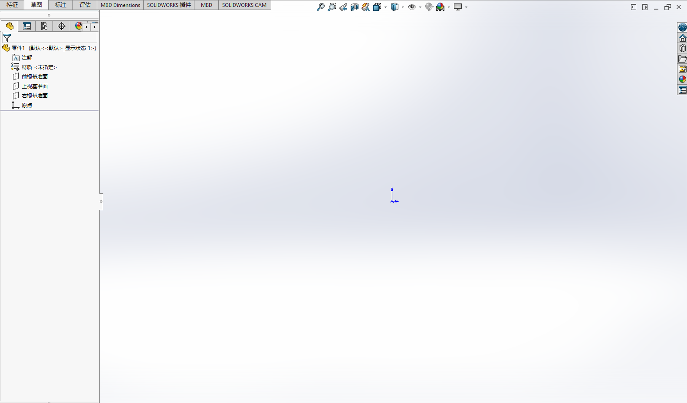
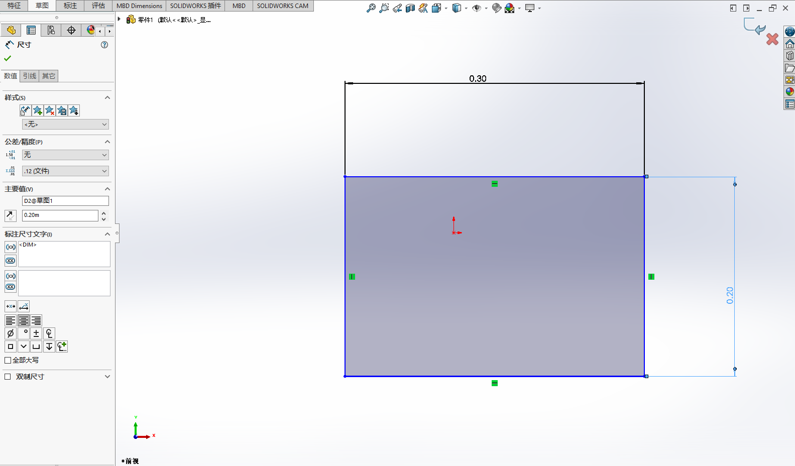
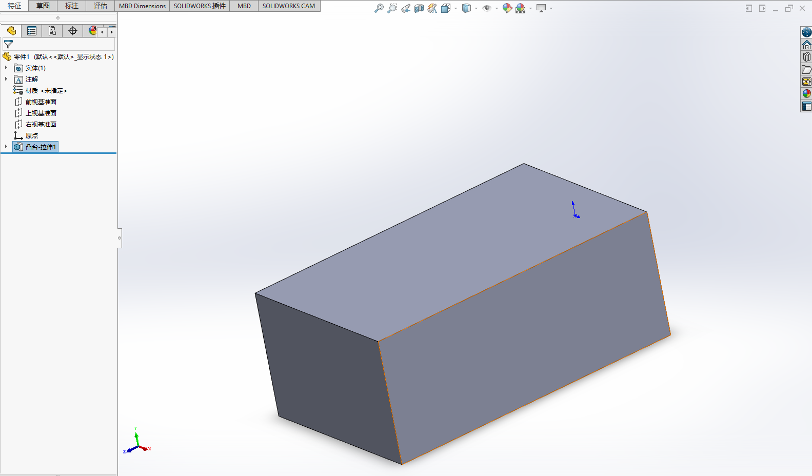
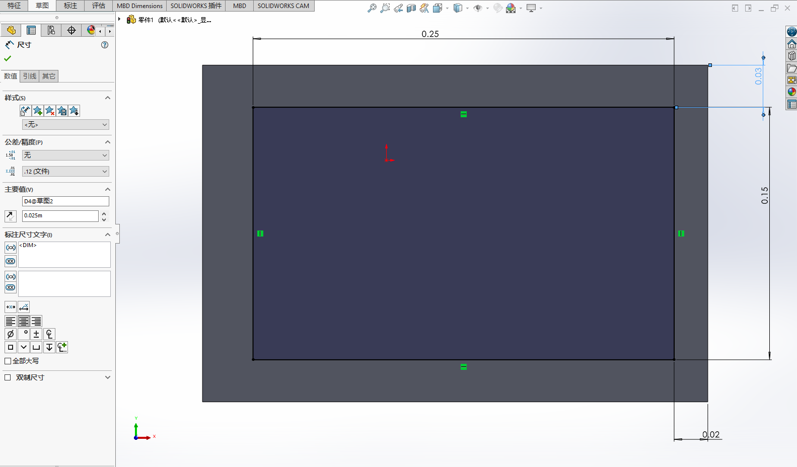
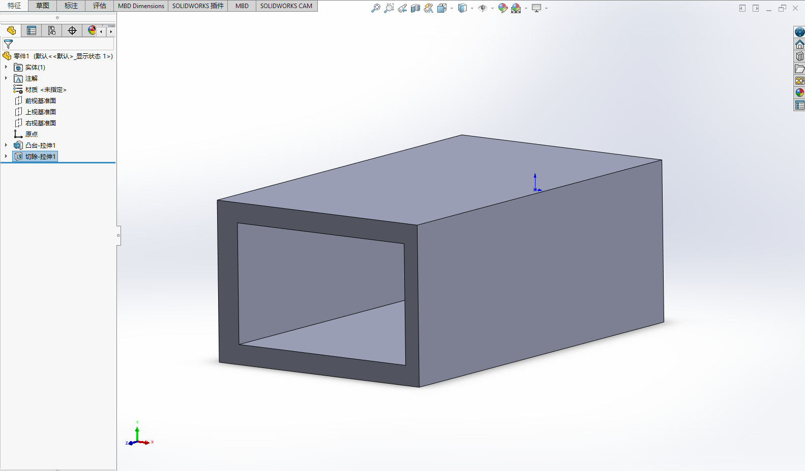
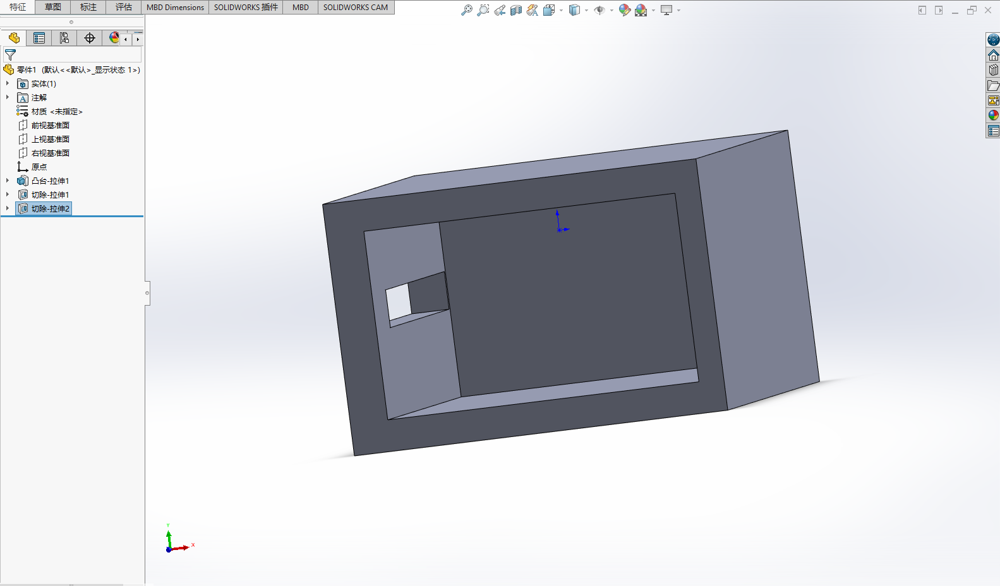
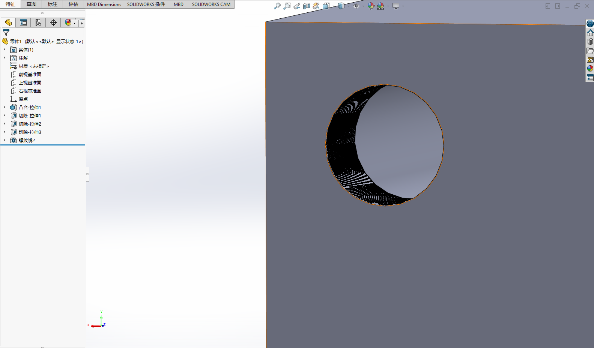

# 基于SolidWorks完成考核任务

Author：@limboo55 

Revice：@PiCaHor

| 版本 | 说明 |备注|
| ---- | ---- | ---- |
| v0.0.0 | 建立文档 |无|
| v0.1.0 | 对solidworks那部分内容进行添加 | @PiCaHor |

## 软件介绍
&nbsp;&nbsp;SolidWorks是一款功能强大的机械设计软件。在空队任务九中，最重要的模块就是机械设计，也是目前任务的难点所在。 

​	对于Solidworks，主要过程就是草图加立体拉伸，从而构建出所需要的零件。

&nbsp;&nbsp;请有志于加入机械组的同学，用心学习教程，在后续的考核任务中，使用SolidWorks完成机械设计也是非常重要的一部分。
## 环境配置
@PiCaHor：这部分的安装后续会给出一个实机操作教程，由于笔者的主机还没有到QAQ之前装完太久又记不住完整的流程了-这里埋一个坑。如果大家在装环境过程中能把整个实现过程整理成文档的话会对大家适当的加分，格式参考[环境配置](./环境配置与准备.md)。麻烦大家等等了~

环境配置这里由于各个版本的不同安装时会出现各种各样的问题，由于原版价格太过昂贵，所以大家需要去探索如何灵活获取，对应的教程会在笔者实际检测后在相应群中给出，由于版权原因不会直接在这里阐述。 

目前找到的几个教程大家可以参考：

[环境配置](https://www.bilibili.com/video/BV1gZ4y1w76v/?spm_id_from=333.788.recommend_more_video.-1&vd_source=28eca9a455dd3210d721b4694d3c4aa1)

[CAD自学网资源](https://www.cadzxw.com/43009.html)

**注**：solidworks在安装过程中记得断开网络连接，以完成验证

## 需要掌握的内容
* SolidWorks的基本操作
* 各种零件的画法
* 使用零件组成简单的装配体  

在学习的过程中，可以使用空队的3D打印机来验证自己的作品。

最基础的大家需要掌握草图绘制，并且对草图进行标注，然后进行拉伸切割等操作。

然后更多的操作，包括标准件的调用等等。 

大家在学习solidwork过程中不需要有太大的压力，机械组最重要的就是你的想法。你学习的很多技巧是为了节省你的设计时间，通常你学会了最简单的使用之后你就可以开始工作了。

关于装配体给大家提一嘴，装配体主要是为了验证机械结构的，如果大家时间非常非常赶，这一部分的优先级可以先降下来后面再补课。大家在extra exam时期最重要的是展现你的想法和思路。

关于大家想要使用3d打印，由于大家还没入队，大家需要打印的部件可以联系机械组的成员进行评估与切片打印，等大家正式加入机械组后会教给大家ideaMaker的使用与3d打印的使用。 

## 一个简单的演示

下面为大家展示一个最简单的零件比如一个纸巾盒的置物架，为了简单设计过程，我们的连接装置直接采用胶连。

首先打开solidworks新建零件

画一个正方体并进行标注，这里简单的做一个30cm x 20cm的盒子

退出草图编辑，进入特征选择凸台拉伸，长度为50cm

接下来进行挖空操作，首先设计草图

尺寸设计完成后来到特征选择拉伸切除，并切除40cm

那么一个纸巾盒置物架初步已经可以完成了

下面对侧面进行开孔最为抽纸的地方

如果我们有用螺丝固定的需求可以对背面打上螺纹孔

基本演示就到这里了，这不是一个非常复杂的东西，大家可以依次作为参考设计出一些更好的，更多的功能也等待大家的探索。

## 推荐教程/参考资料
[SolidWorks官方文档](https://help.solidworks.com/2020/Chinese-simplified/SolidWorks/sldworks/r_help.htm)  

[B站的SolidWorks教程](https://www.bilibili.com/video/BV1iw411Z7HZ?spm_id_from=333.337.search-card.all.click&vd_source=28eca9a455dd3210d721b4694d3c4aa1)

