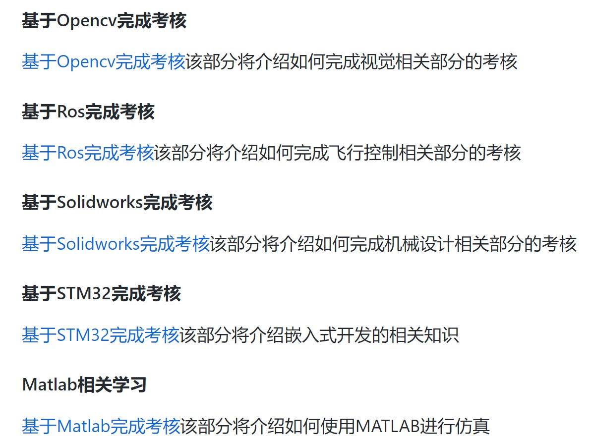

# 考核须知

Author：@LinHuangnan

| 版本 | 说明 |时间|备注|
| ---- | ---- | ---- |----|
| v0.0.0 | 建立文档 |2022.8.7|无|

## 前言

该部分将会介绍考核的注意事项，请参加考核的同学们认真阅读

## 关于考核仓库指南

我们建立了[考核仓库指南](https://github.com/SYSU-AERO-SWIFT/Tutorial_2022)帮助各位熟悉考核流程，掌握各种工具（ROS,OPENCV,solidworks，MATLAB，STM32）的基本用法。请参考考核仓库指南，提供的信息完成考核，仔细阅读Git部分，按要求提交考核任务。欢迎对不涉及具体题目而与考核有关的知识点做补充。

## 发起Issues

GitHub Issues 用于项目交流，如有任何问题可以在考核仓库的 [Issues](https://github.com/SYSU-AERO-SWIFT/Tutorial_2022/issues) 中发起讨论（不是自己的仓库），提交需要遵循模板。有意义的讨论将加分并载入考核仓库指南中。

## 提交[Pull Requests](https://github.com/SYSU-AERO-SWIFT/Tutorial_2022/pulls)
考核任务还在不断更新优化之中，在提交考核任务之外，如有任何推荐的补充资料或者错误更正也欢迎按模板提交 [PR](https://github.com/SYSU-AERO-SWIFT/Tutorial_2022/pulls)，我们会将你的修改建议合并到考核仓库中。

## 注意事项
- 秋季实战时间为 9.20 至 10.24 (或 10.31，可能根据任务难度有所调整)，为期五至六周。前三周为基础考核任务，后二至三周为项目考核任务。请合理安排时间，认真对待考核。我们会根据大家考核期间的综合表现于11月公布考核结果。
- 考核标准将采用积分制，基础考核评分将划定标准线，项目考核评分将分为基础部分和发挥部分，我们将给每个人打分以保证公平性。
- 基础好的队员可以快速完成已经掌握的部分，而着重完成后期的项目考核，对于基础薄弱的队员，请认真学习打好扎实的基础。整个考核都需要有 C++ 编程基础，如果对编程技能还不熟练请尽快学习。整个考核会比较有难度，希望你坚持下来，必将有所收获。
- 基础考核有选修内容，选修内容不是必须的，但我们建议你掌握尽可能多的技能，这将会帮助你提高效率。项目考核要求你选择一个项目进行完成。
- 请大家在每周的截止日期前按时完成规定任务。由于考虑到参与考核的人数较多，我们规定，基础考核的提交时间为【每周日的23:59分前截止】，项目考核的提交不早于最后一周，请在截止前按时上传。你可以根据自己的时间安排提前完成或先做后面的内容（但请不要提前上传），这并不影响考核结果。如果你提前做后面的任务，请遵守下文中考核流程检查单注意事项。如果有极其特殊原因需要推迟完成请在考核群内提前说明。
- 请你们独立认真完成，不要抄袭其他同学的代码，我们将会仔细审阅每一份工程的代码。去年已发现有同学抄袭，一经发现你就没了。
- 你们若有问题可以通过 Issue 的方式来提问，如果有推荐的学习资料可以 Pull request 来补充。
- 请更多地通过 Issue 的方式来发起正式的讨论，可以使用 QQ 群发问 (现有队员会尽力解答)，多尝试通过 Google 获得解答。

### 积分制详细说明与补充
| 评分项 | 积分值 |
| ---- | ---- | 
| 面试 | 50分 |
| 基础考核 | 450分 |
| 项目考核 | 500分 |

### 相关事项
- 可自由推送更改到自己的工作仓库，但完成任务后提交 PR 要谨慎，我们以截止时间前的最后一次 Pull request 的结果作为标准。
- 积分值（包括细项）只精确到小数点后一位。
- 请在截止时间前及时提交你的代码，如果超过截止时间未提交，我们会视情况相应扣分（每迟交一天，应得分数会扣除 10%）。
- 如果最终版本里出现了错误文件，我们会视情况相应扣分。
- 本评分标准最终解释权由中大空中机器人队所有。

### 考核任务提交方式
#### 区分考核仓库和工作仓库

