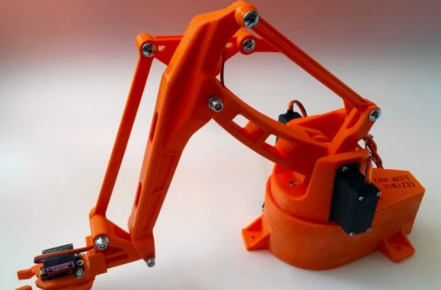
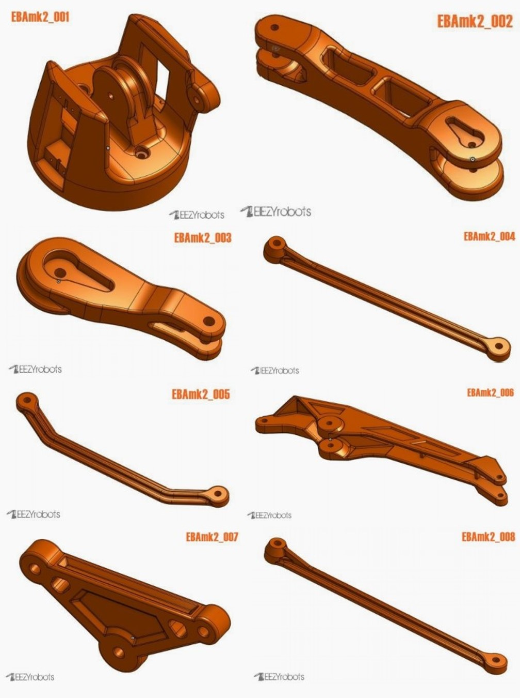
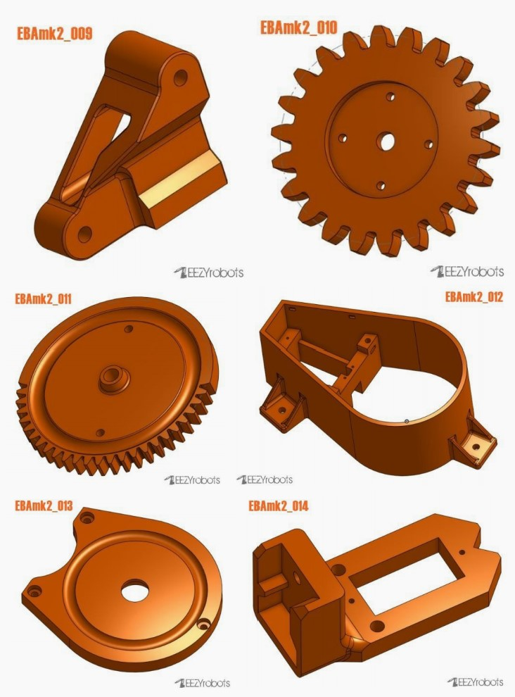
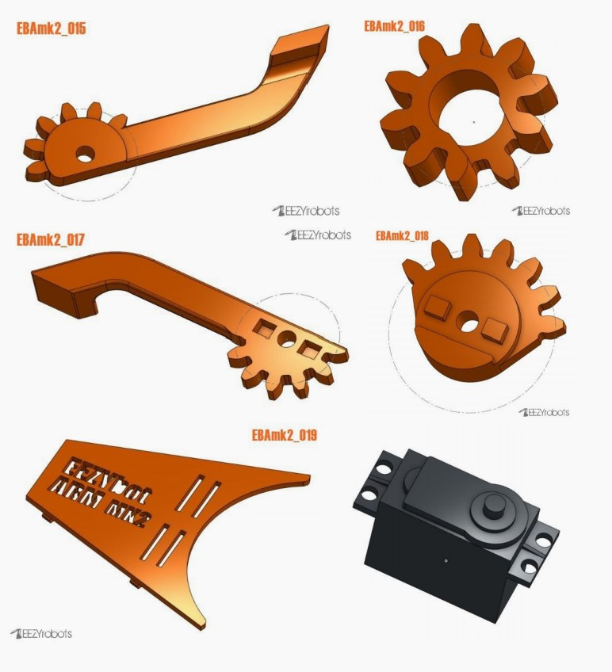

# 机械组第一周考核任务安排

Author：@LinHuangnan

Revise：@PiCaHor

| 版本 | 说明 |备注|
| ---- | ---- | ---- |
| v0.0.0 | 建立文档 |无|
| v0.0.1 | Revise&更正错别字 |@PiCaHor|

## 说明
- 第一周考核需要通过3D打印制作机械臂，可以在淘宝上找厂家进行3D打印，开好发票，通过考核将会提供报销
- 驱动机械臂运动的舵机等零件也需要在淘宝上购买，开好发票，通过考核将提供报销
- 第一周的任务成果只需提交SolidWorks设计的文件和一份说明文档，写明设计思路和各个文件的作用
- 很多东西开放实验室(北实验楼C301)都有，要学会去白嫖

## SolidWorks安装

参考考核仓库指南Solidworks部分

## 任务安排
### 1、自学任务安排 
- 自学SolidWorks，参考[B站的SolidWorks教程](https://www.bilibili.com/video/BV1iw411Z7HZ?spm_id_from=333.337.search-card.all.click&vd_source=28eca9a455dd3210d721b4694d3c4aa1)，只需要学到`P21附加课7 装配体阵列&镜像与外观`即可
- 刷完教程之后，可以跟着B站上的其他画一些有趣的东西，比如四旋翼的建模等等，来巩固刚刚学会的Solidworks基本操作技巧

### 2、使用SolidWorks设计4自由度机械臂

我们给大家提供了一个参考示例，大家可以根据下面提供的参考示例来`复现`或者`设计`自己的4自由度机械臂，本周考核的目的在于使大家尽快熟悉SolidWorks的操作，因此无论是复现我们下面给出的示例，还是自己设计一个新的4自由度机械臂均可

**注** 在`机械部分参考示例`文件夹下，我们已经提供了该参考示例的STL模型，大家可以使用SolidWorks打开研究每一部分的结构和作用

#### 4自由度机械臂装配之后的模型如下：

#### 4自由度机械臂包含的零件如下：

#### 4自由度机械臂的安装过程如下：

#### 需要采购的零件如下：
- 3个955或946舵机
- 1个SG90舵机
- M3*10，M3*20，M4*20，M4*30，M4*40螺丝若干，M6*25螺丝若干，M4*60mm螺纹杆，M4*32mm螺纹杆
- 25个直径6mm的球体

**注** 开好发票，通过考核即可报销

**注** 本周考核任务与后面的几周有很大的关联性，请认真完成绘制并且3D打印装配，后续将在第一周的基础上用STM32进行机械臂驱动代码的编写

**注** 如果没有设计或则复现出很好的结构，可以直接将`机械部分参考示例`文件夹下的文件发到淘宝打印加工，以保证后续考核任务的顺利进行

**注** 自己完成从外观设计，3D打印到驱动控制代码的编写，最终完成整个4自由度机械臂的设计，是一个很有趣的过程，并且通过考核的同学实验室也能够提供报销，同学们可以好好利用这次机会，DIY出一个自己的4自由度机械臂。

## 成绩评判
| 打分项 | 分值 |
| ---- | ---- | 
| 设计的零件和装配体 | 200分 |
| 设计文档 | 50分 |
