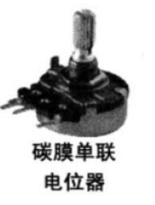

# 机械组第二周考核任务安排

Author：@LinHuangnan

Revise：@PiCaHor

| 版本 | 说明 |备注|
| ---- | ---- | ---- |
| v0.0.0 | 建立文档 |无|
| v0.0.1 | Revise&更正错别字 |@PiCaHor|

## 说明
- 第二周考核的难度不大，主要是帮助大家熟悉STM32的使用
- STM32F103C8T6最小系统板，面包板，杜邦线，0.96寸OLED的购买需要提前开好发票，通过考核的同学将提供报销

## STM32的入门

参考考核仓库指南STM32部分

## 任务安排
### 1、自学任务安排 
- 自学STM32，参考考核仓库指南STM32部分

### 2、使用STM32完成一些常见外设的驱动，提交视频即可

- 实现流水灯，这里要求7个LED，每个LED交替亮，每个LED亮的时间为500ms，参考下图，必须使用TIM定时器定时，不能使用软件延时：

- 按键实现LED的开关，按一下LED亮，再按一下LED灭

- 实现电位器调节LED的亮度，思路是用ADC读取电位器的阻值，根据读取的阻值调节PWM波的占空比，当电阻全部接入时LED最亮，反之最暗，电位器即滑动变阻器，可以使用如下电位器

- 学会使用0.96寸OLED的驱动，显示姓名学号

## 成绩评判
| 打分项 | 分值 |
| ---- | ---- | 
| 流水灯 | 50分 |
| 按键 | 50分 |
| 亮度调节 | 50分 |
| OLED显示 | 50分 |
