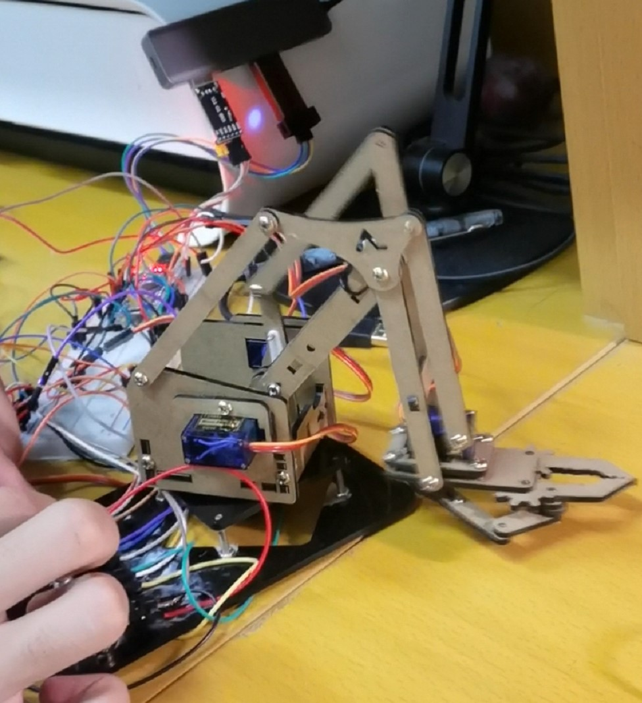

# 机械组第三、四周考核任务安排

Author：@LinHuangnan

Revise：@PiCaHor

| 版本   | 说明              | 备注     |
| ------ | ----------------- | -------- |
| v0.0.0 | 建立文档          | 无       |
| v0.0.1 | Revise&更正错别字 | @PiCaHor |

## 说明
主控采用STM32F103C8T6,如果使用Arduino总分*70%

## 任务安排
### 电位器控制舵机
- 使用电位器控制四个舵机，旋转电位器使机械臂到达不同的位置
- 使用电位器控制四个舵机，夹起指定物品到指定位置

### 复现
- 第一次按下按钮，使用电位器控制四个舵机，夹起指定物品，并记录
- 第二次按下按钮，能够复现刚才的操作

### 远程控制机械臂
- 旋转WIFI模块或者蓝牙模块，上位机（电脑、手机或者其他）操作实现远程控制机械臂操作

### OLED显示
- 显示四个舵机的旋转角度

### 上位机反馈
- 电脑上显示机械臂的实时状态

**注** 需要上传演示视频和代码

最终效果可以参考[这个视频](https://www.bilibili.com/video/BV16e4y1Y77M?share_source=copy_web&vd_source=34ed110d766ac5910b35ccc9afedda6e)，当然这个机械臂做的比较粗糙，如果大家会用Altium Designer或者立创EDA的画板子，建议自己画一个板子，有一说一连这么多杜邦线确实有点丑，而且稳定性也很差

## 成绩评判
| 打分项 | 分值 |
| ---- | ---- | 
| 电位器控制舵机 | 100分 |
| 复现 | 100分 |
| 远程控制机械臂 | 100分 |
| OLED显示 | 100分 |
| 上位机反馈 | 100分 |

