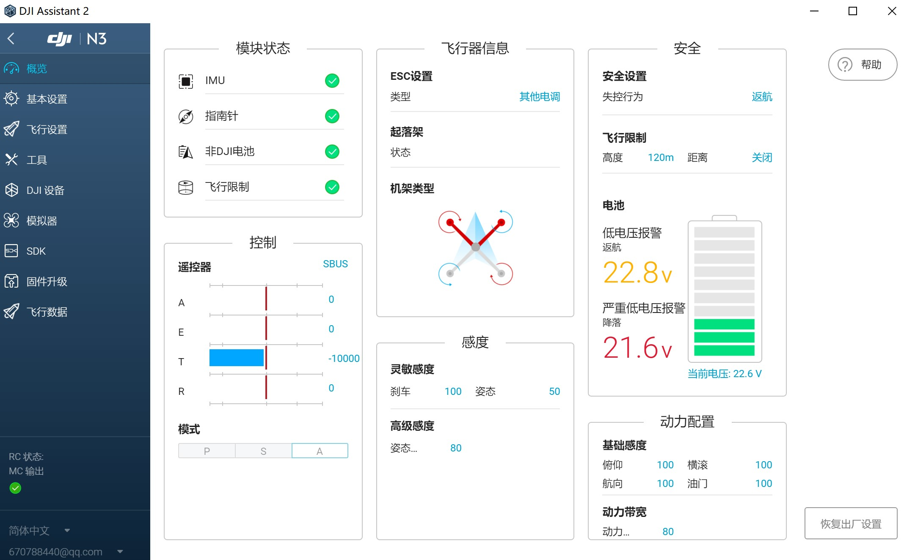
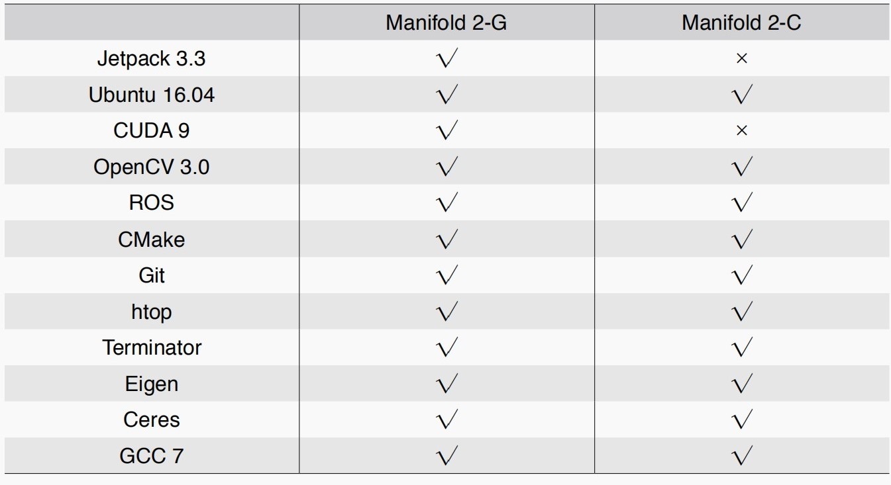
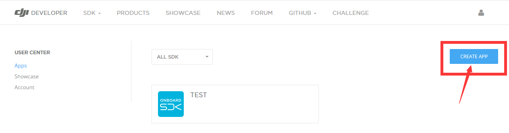
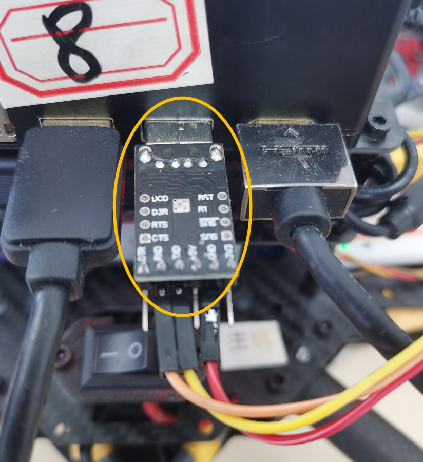
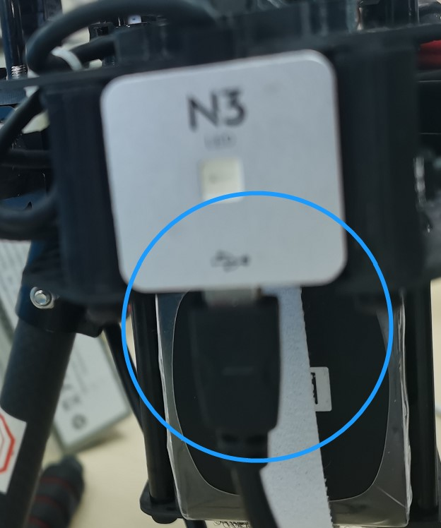
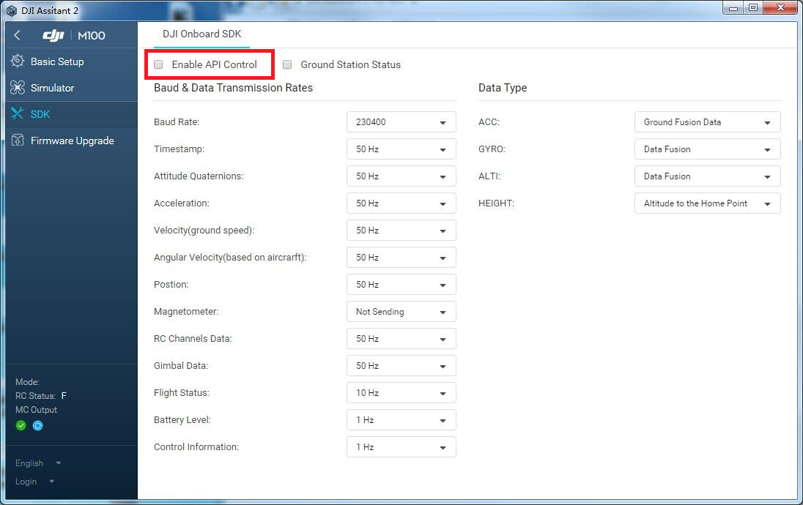
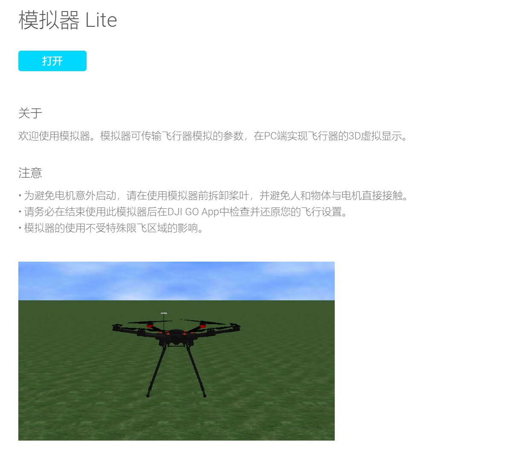

Author：@LinHuangnan

Revise：

| 版本 | 说明 |备注|
| ---- | ---- | ---- |
| v0.0.0 | 建立文档 |无|
| v0.0.1 |  | |

# 基础考核 - 第三周（9.19-9.25）

**本周任务：**

1. 熟悉大疆**OSDK**开发环境配置的过程；
2. 使用大疆**OSDK-ROS**，并依赖**N3**飞控对无人机进行控制；
3. 为了上手**OSDK-ROS**，可以先理解大疆提供的demo，并在demo的基础进行修改实现自己的想法，下面有对大疆例程的简单说明。

**评分标准：**

| 评分项                                                       | 分值 |
| ------------------------------------------------------------ | ---- |
| 编写一个发布者以一定频率发布目标位置，并控制无人机接近这个目标点 | 200  |
| 设定两个固定点(它们之间距离适当即可)，控制无人机围绕这两个目标点飞行(轨迹可以是任意形状)，具体请参考 考核群 文件**mission9rules.pdf** | 250  |
| 无人机可自主记录飞行的路程，并在到达一定值(大小可自定)后停下 | 80   |
| 使用 **rosbag** 记录无人机的速度信息                         | 70   |

**任务说明：**

1. 最后提交的文件包括你的程序和运行截图；

2. 如果没有时间到实验室实操，仅仅提交程序也可以，只要实现逻辑正确即可。

**下面是配置流程以及例程的说明**

# 飞控组第三周考核环境配置

## 软件安装

### DJI Assistant 2
DJI Assistant 2是一款无人机调参软件，可以快速的对大疆的无人机产品进行参数的调节，也可帮助用户进行产品固件的更新。

#### [下载地址](https://www.dji.com/cn/downloads/softwares/assistant-dji-2)

<div align=center></div>

## 硬件介绍

### 妙算Manifold-2C
Manifold2是DJI为OSDK开发者打造的第二代微型机载计算机，Manifold2预装Ubuntu16.04操作系统，

- 用户名：dji
- 密码：dji

Manifold2预装了如下软件

<div align=center></div>

更多详细信息参考[Manifold2用户手册](./doc)

### N3飞控

作为NAZA飞控系列的最新一代产品，N3多旋翼飞控系统采用DJI 大疆最新的控制导航算法。N3飞行控制系统包含主控器（内置双IMU、数据记录仪和气压计），GNSS-Compass模块，电源管理模块（PMU）和LED模块。

更多详细信息参考[N3飞控用户手册](./doc)

## 模拟器仿真
### 0、安装依赖软件（已配置好，此步可省略）
从Github 上获取DJI Onboard SDK，并在DJI Onboard SDK 目录下使用如下命令安装DJI Onboard SDK

```shell
mkdir build 
cd build 
cmake.. 
sudo make -j7 install
```

### 1、创建工作空间
1.1 创建ROS工作空间

```shell
mkdir tasks
cd tasks
mkdir src
```

1.2 将Onboard-SDK-ROS-3.7.0文件夹下的dji_sdk和dji_sdk_demo放到src文件夹下

[Onboard-SDK-ROS-3.7.0下载地址](./package)

1.3 打开终端，进入tasks目录

### 2、编译代码

```shell
catkin_make
```

### 3、配置sdk.launch文件

sdk.launch需要APPID和App Key两个信息。这就需要先在developer上新建一个app来获取

<div align=center></div>

### 4、硬件连接
- cp210x连接妙算与N3
<div align=center></div>

- 查看串口，修改对应的sdk.launch文件

```shell
dmesg
```

- 遥控器对频

- 打开`DJI Assitant 2`

- 通过数据线将N3飞控的LED模块与装有`DJI Assitant 2`的电脑连接

<div align=center></div>


- 此时看到绿灯慢闪，表明飞行器状态正常，可以起飞

### 5、运行示例程序
- 选择N3多旋翼飞行控制系统
<div align=center></div>

- 使能SDK API
<div align=center></div>

- `DJI Assitant 2`配置：机架类型选择四旋翼，遥控器选择SBUS，电池选择6S，固件选择V1.7.6.0，波特率选择921600

- 打开模拟器，开始仿真
<div align=center></div>

- 运行大疆主节点

```shell
roslaunch dji_sdk sdk.launch
```

- 运行程序

```shell
rosrun dji_sdk_demo demo_flight_control
```

## 实际飞行

### 妙算联网
- 安装网卡驱动

```shell
cd RTL8812AU_Linux
chmod 777 install.sh
./install.sh
```

- 手机开热点，PC和妙算连接同一个手机热点，PC远程控制妙算

- 在妙算的命令行输入如下命令，查看ip地址
```shell
ifconfig
```

### 远程控制
- 打开Windows PowerShell，输入如下命令，建立远程连接
```shell
ssh dji@...    (其中...为上一步的ip地址)
```

### 分屏功能介绍
#### 在妙算中使用sudo apt-get install screen安装screen工具
#### 如何使用screen
- 输入命令screen使用工具
- 上下分屏：ctrl+a 再按shift+s
- 切换屏幕：ctrl+a 再按tab键
- 新建一个终端：ctrl+a 再按c
- 关闭一个终端：ctrl+a 再按x

# 熟悉DJI OSDK ROS

##### 运行的依赖关系

- 运行大疆的例程前需要先启动大疆的**ros**节点**dji_sdk**，且必须以**roslaunch Onboard-SDK-ROS/dji_sdk/launch/sdk.launch**的方式，以使大疆的主节点读取**app_id**获取**sdk**控制权。

- 利用大疆的开发包进行无人机的控制的原则是从大疆提供的服务获取响应或者向大疆订阅者对应的节点发送消息，从而大疆的主节点将调用**Onboard-SDK**中定义的方法通过串口向飞控发出指令，完成无人机控制或无人机状态的接收。

##### 例程 Onboard-SDK-ROS/dji_sdk_demo/src/demo_flight_control.cpp

- 大疆提供的一个**demo**演示如何对无人机进行简单的速度控制，在这个例程中，无人机按照指令，将从起飞点开始依次移动到两个目标点，大疆的例程中特意定义了类 **Mission** 来保存无人机进行任务的状态以及程序发出的目标指令，可以在与 **src** 同一级的 **include** 目录下的 **demo_flight_control.h** 中找到 **Mission** 的定义。

例程的 **main** 函数：

```c++
//之后将利用这个发布者向大疆的主节点发送控制指令
ctrlPosYawPub = nh.advertise<sensor_msgs::Joy>("/dji_sdk/flight_control_setpoint_ENUposition_yaw", 10);
//通过这两个函数获取控制权并起飞
bool obtain_control_result = obtain_control();
bool takeoff_result = monitoredTakeoff();
//保存起飞悬停点的GPS坐标，设置第一个目标点，并且这个目标点是相对于的start_gps_location的
// state=1，说明在前往第一个目标点的路上
square_mission.start_gps_location = current_gps;
square_mission.setTarget(0, 6, 3, 60);
square_mission.state = 1;
```

辅助函数

```c++
void
localOffsetFromGpsOffset(geometry_msgs::Vector3&  deltaNed,
                         sensor_msgs::NavSatFix& target,
                         sensor_msgs::NavSatFix& origin)
{
  double deltaLon = target.longitude - origin.longitude;
  double deltaLat = target.latitude - origin.latitude;

  deltaNed.y = deltaLat * deg2rad * C_EARTH;
  deltaNed.x = deltaLon * deg2rad * C_EARTH * cos(deg2rad*target.latitude);
  deltaNed.z = target.altitude - origin.altitude;
}
//这个函数进行gps坐标到NED（指：北 东 下，可以理解为当地坐标系）的转换，这是因为指令是相对NED坐标的，
//而无人机获取的是gps坐标，不能直接计算需要的速度指令，因此需要转换
```

回调函数```void gps_callback(const sensor_msgs::NavSatFix::ConstPtr& msg)```

```c++
//根据Mission对象的状态，进行目标点的转换
switch(square_mission.state)
    {
      case 0:
        break;

      case 1:
        if(!square_mission.finished)
        {
          square_mission.step(); //无人机尚未到达第一个目标点
        }
        else
        {
          square_mission.reset();
          square_mission.start_gps_location = current_gps; //注意这里重设了起始点
          square_mission.setTarget(6, 0, 0, 0);
          square_mission.state = 2;
          ROS_INFO("##### Start route %d ....", square_mission.state);
        }
        break;

      case 2:
        if(!square_mission.finished)
        {
          square_mission.step();
        }
        else
        {
          ROS_INFO("##### Mission %d Finished ....", square_mission.state);
          square_mission.state = 0;
        }
        break;
    }
```

控制 函数````void Mission::step()````

```c++
localOffsetFromGpsOffset(localOffset, current_gps, start_gps_location);
//localoffset是大地坐标下无人机当前位置相对起始点的坐标,每到达一个目标点，起始点都将重设
double xOffsetRemaining = target_offset_x - localOffset.x;
double yOffsetRemaining = target_offset_y - localOffset.y;
double zOffsetRemaining = target_offset_z - localOffset.z;
//计算大地坐标下无人机距离目标点的值
//发送指令，flag变量的作用是确定需要控制的维度
sensor_msgs::Joy controlPosYaw;
uint8_t flag = (DJISDK::VERTICAL_VELOCITY   |
                DJISDK::HORIZONTAL_VELOCITY |
                DJISDK::YAW_RATE            |
                DJISDK::HORIZONTAL_GROUND   |
                DJISDK::STABLE_ENABLE);

controlPosYaw.axes.push_back(xCmd);
controlPosYaw.axes.push_back(yCmd);
controlPosYaw.axes.push_back(zCmd);
controlPosYaw.axes.push_back(yawDesiredRad);
controlPosYaw.axes.push_back(flag);
ctrlPosYawPub.publish(controlPosYaw);

/** 注：info_counter 用于限制消息的发送频率；
	    break_counter > 50 时认为无人机已经达到一个目标点，break_counter只有在无人机处于目标点附近的阈值内才会累加 **/
```

##### 更进一步

查看**dji_sdk/src/modules/dji_sdk_node_control**

```c++
//这是"/dji_sdk/flight_control_setpoint_ENUposition_yaw"话题订阅者对应的回调函数
void
DJISDKNode::flightControlPxPyPzYawCallback(
  const sensor_msgs::Joy::ConstPtr& pMsg)
{
  uint8_t flag = (Control::VERTICAL_POSITION |
                  Control::HORIZONTAL_POSITION |
                  Control::YAW_ANGLE |
                  Control::HORIZONTAL_GROUND |
                  Control::STABLE_ENABLE);

  float px    = pMsg->axes[0];
  float py    = pMsg->axes[1];
  float pz    = pMsg->axes[2];
  float yaw   = pMsg->axes[3];

  flightControl(flag, px, py, pz, yaw);
}

// 在当前文件中还有一个函数void DJISDKNode::flightControl(uint8_t flag, float xSP, float ySP, //float zSP, float yawSP)
//这个函数的最后通过vehicle类下的control类中的flightCtrl函数向飞控发出指令

  Control::CtrlData ctrlData(flag, xCmd, yCmd, zCmd, yawCmd);
  vehicle->control->flightCtrl(ctrlData);

//vehicle类的定义可以在Onboard-SDK中找到，所以说Onborad-SDK-ROS的编译与运行依赖于Onboard-SDK库
//在control类的定义中，flightCtrl(ctrlData)又通过linker类进行USB通信，将指令发送出去
```


