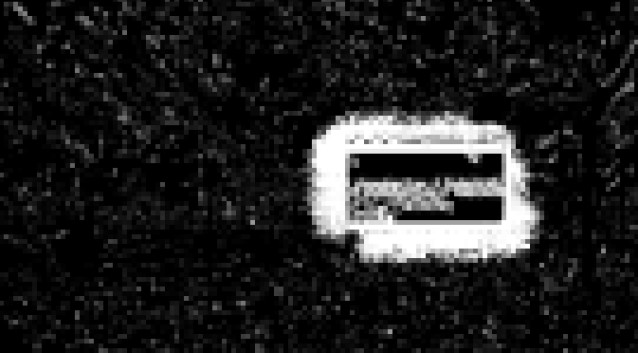
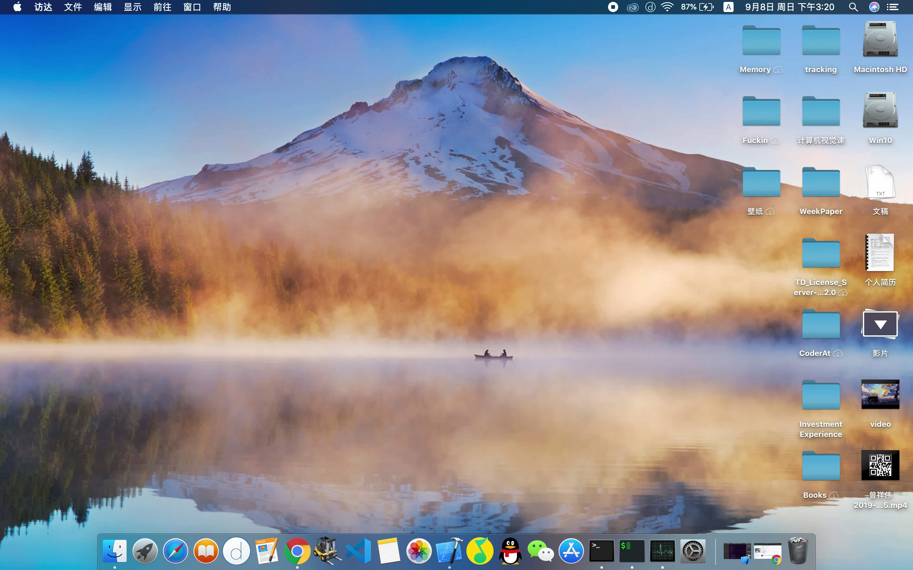
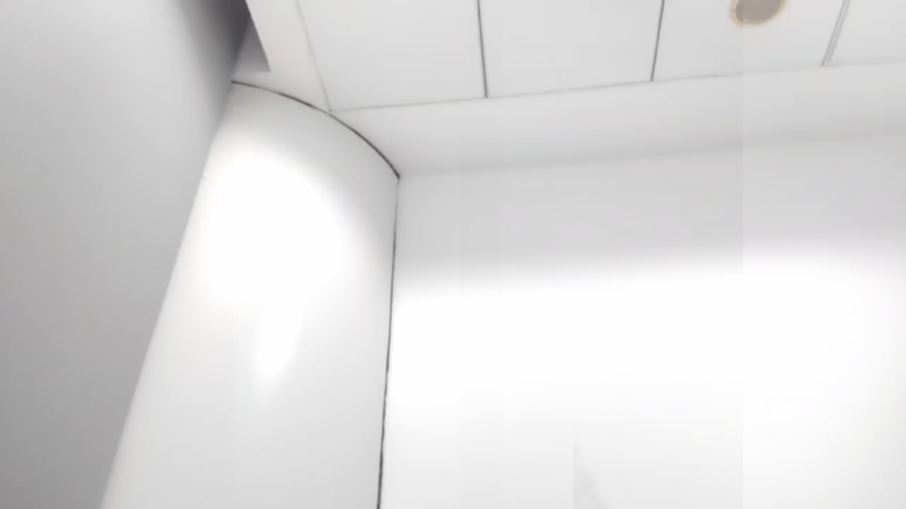

# 考核报告 - wk 2

- Author: 黄宇杰 @hyjack-00
- Date: 2022-9-25
- Group: 视觉组

---

## 视频背景还原器

提供的三个视频样例有较大区别，video1, video2 属于连续运动前景的视频，录屏中背景会产生噪点，且遮挡物外围各方向具有模糊的边缘影子，更接近于现实场景；而 video0 属于人工合成的不连续前景的视频，总帧数仅为 19，前景清晰不连续，且背景几乎不变。

考虑到算法泛用性，这里主要针对前者完成模块编写，后者提供一个还原水平更高但是泛用较差的子模块。

### 基于帧差与前景面积划分

原理：利用相邻两帧之差确定在视频中变动的像素，利用 `resize` 函数分块统计变动像素点的数量（如下图），当变动点的密度超过设定的阈值（默认200/255）时，即可认定其为前景遮挡物，由此可以确定前景的面积范围，在剔除前范围后不断用剩下部分，简单加权更新背景图。



- 实际代码中直接遍历像素确定前景矩形框。这样简单的前景划分只对 resize 缩小过后的图像进行遍历，具有很高的算法效率，但需要足够多的帧数以保证背景图每一处都有机会落在矩形框外。
- 提高鲁棒性
  - 对已确定的前景矩形框进行边缘外扩
  - 加入异常帧检测（前景面积过大），异常时不采用该帧
  - 加入静止帧检测（前景面积过小），静止时采用上一个合法帧的前景矩形框

### 基于摩尔投票法

原理：对各通道每个像素点取时间上的众数值，作为最终背景。

摩尔投票法需要众数值在所有数据中占有一半以上的数量，但对于 video0 的确定性背景能够最大程度还原出背景完全原始的像素值。


### 测试结果

#### 运行时间

- 基于帧差与前景面积划分

  其中 video3 为自行拍摄的测试样本，视频见 `resource`

  | 视频名 | 平均运行用时 / s |
  | ------ | ---------------- |
  | video1 | 0.65 ± 0.05      |
  | video2 | 3.25 ± 0.1       |
  | video3 | 0.99 ± 0.12      |

- 基于摩尔投票法

  由于缺乏泛用性，该子模块未进行算法速度优化，但理论上运行速度是优于前者的

  | 视频名 | 平均运行用时 / s |
  | ------ | ---------------- |
  | video0 | 2.62 ± 0.1       |

#### 还原结果

也见 `wk_2/BG_recovery/result`





自行拍摄视频进行泛用度检验。发现由于算法记忆性较低，在实际场景下对光亮变化过于敏感，但基本能将前景完全去除。




## 程序设计练习

自行补充：节点定义，测试主程序，测试样例。

使用 Makefile 编译运行输出：

```
(3->9->2) + (7->3->7->9) = (0->3->0->0->1)
```

即 293 + 9737 = 10030


## wk_2 文件清单

> 之前运行的好好的，提交前出 bug 了于是延迟了一天，看在这么快的运行速度上饶了我吧 T_T

```
.
├── BG_recovery
│   ├── bin
│   ├── build
|   ├── .gitignore
│   ├── inc
│   │   └── recovery.h
│   ├── makefile
│   ├── readme.md
│   ├── resource
│   │   ├── video0.mp4
│   │   ├── video1.mp4
│   │   └── video2.mp4
│   ├── result
│   │   ├── video0_background.jpg
│   │   ├── video1_background.jpg
│   │   └── video2_background.jpg
│   ├── src
│   │   └── recovery.cpp
│   └── test
│       └── recovery_test.cpp
├── programming_ex
│   ├── addTwoNumbers.cpp
│   └── .gitignore
├── report_pic
│   ├── change_points.jpg
│   ├── video0_background.jpg
│   ├── video1_background.jpg
│   ├── video2_background.jpg
│   └── video3_background.jpg
└── report_wk_2.md

```

