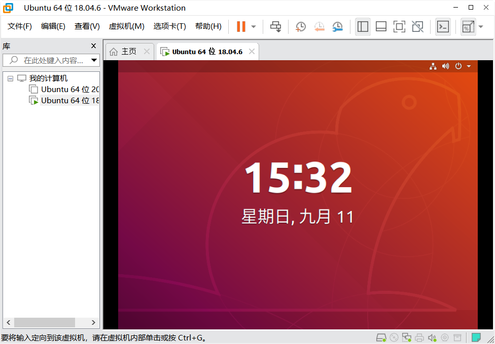
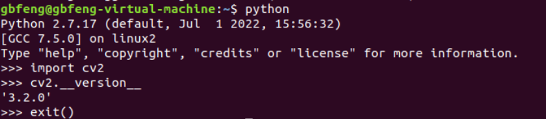
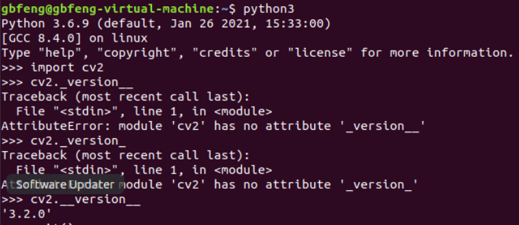
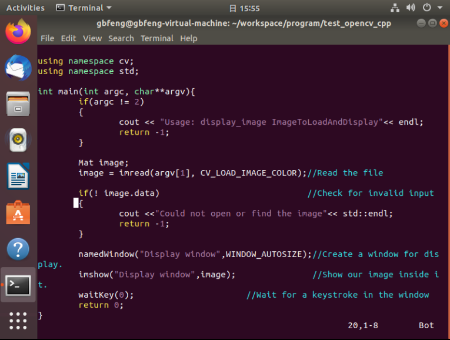
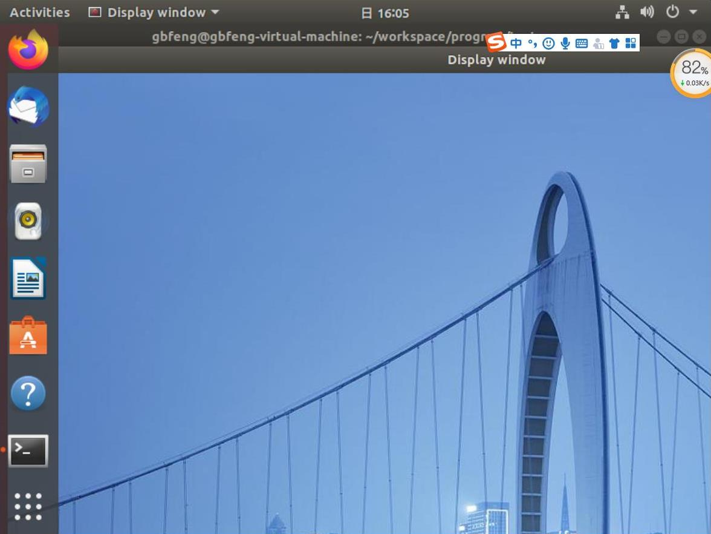
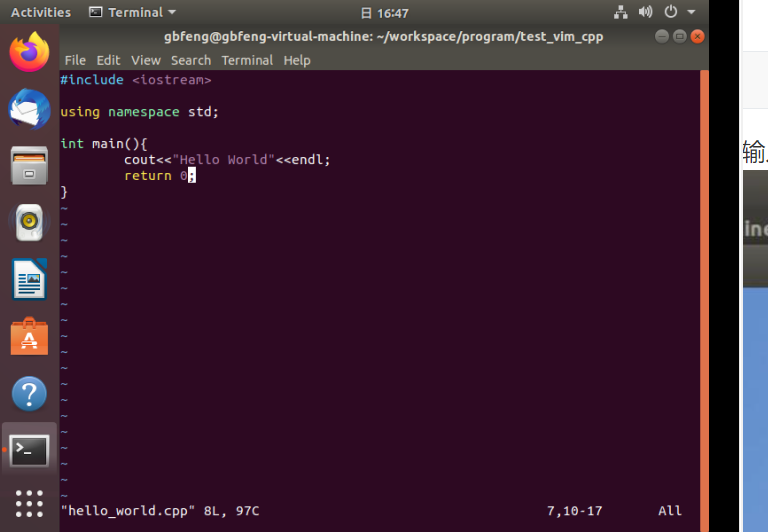
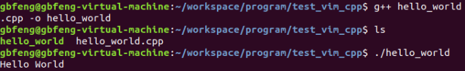

# 第一周空队考核报告
Author: @gbfeng

Time: 2022/9/11

|版本|说明|备注|
|:--:|:--:|:--:|
|v0.0.0|建立文档|无|
##Linux系统安装
- 从[微信公众号：电脑软件驿站](https://mp.weixin.qq.com/s/-0bTGJ0ZLHgqBIvO2KaWEQ)获得免费的VMware Workstation 16 Pro安装包和激活码并安装。过程中可能出现安装闪退，通过清理旧版VM注册表，关闭杀毒软件的方式可能可以解决（不知道怎么的就解决了）。
- 从[清华镜像源](https://mirrors.tuna.tsinghua.edu.cn/ubuntu-releases/)获得ubuntu 18.04.6版本的.iso镜像文件。从官网下载的文件后缀为iso.torrent，会出现操作系统无法找到的问题。
- 按照提供的参考材料一步步操作即能安装好虚拟机。

##Opencv安装
- 更新apt包管理器后安装。不更新直接安装会出现could not fetch url的问题。
- 之后按照提供的资料一步步安装
```
$ sudo apt-get update
$ sudo apt install libopencv-dev
```
-  验证python安装opencv



- 验证python3安装opencv


-  验证OpenCV with C++
	- 安装vim编辑器并编写示例程序
	```
	$ sudo apt install vim
	```
	
	```
	- 在安装opencv的时候自带了g++的安装，可以直接编译，pkg-config参数设置导入的头文件
	$ g++ display_image.cpp -o display_image `pkg-config --cflags --libs opencv`
	```
	- 打开可执行文件，输入图片路径,不要输入尖括号
	```
	$ ./display_image bridge.png
	```
	
## vim编辑器的使用
- 上文已经安装好了vim编辑器以及g++编译器
- cd到对应文件夹，创建文件
```
$ vim hello_world.cpp
```
-  按i进入编辑模式，编写代码，按esc退出编辑模式，输入：进入命令模式，输入wq保存并退出。

- 用g++编译代码，得到可执行文件，运行
```
g++ hello_world.cpp -o hello_world
```

## 科学上网
- 下载[clash for window](https://zhuanlan.zhihu.com/p/543927762)，获取[IP](https://xsus.buzz/)，具体内容狗头保命。

  

