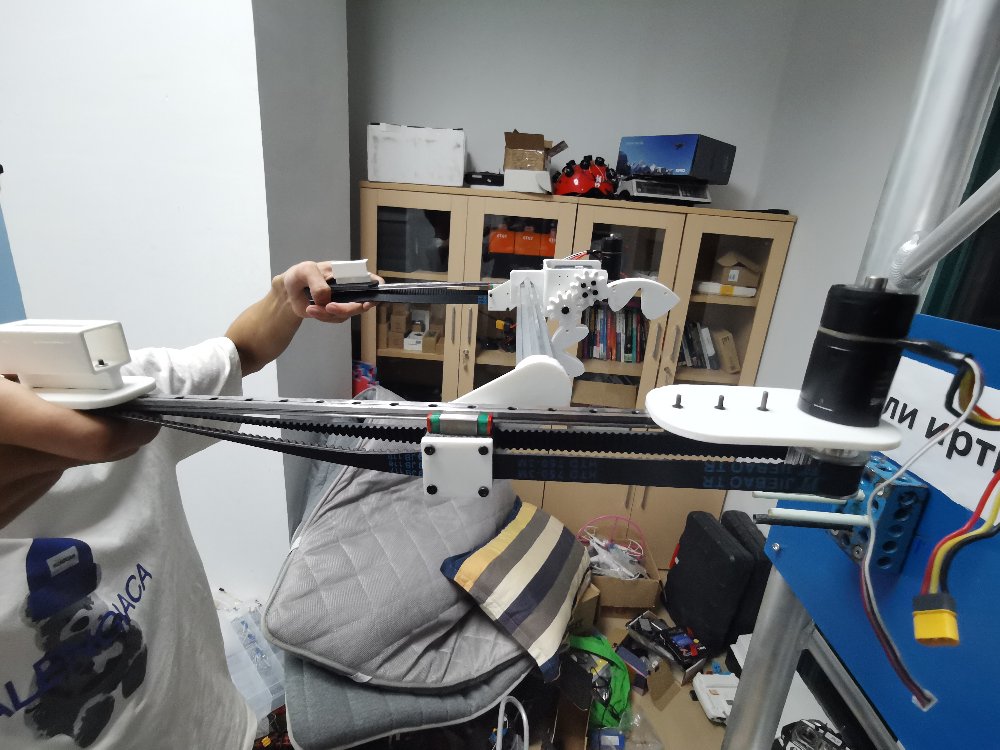
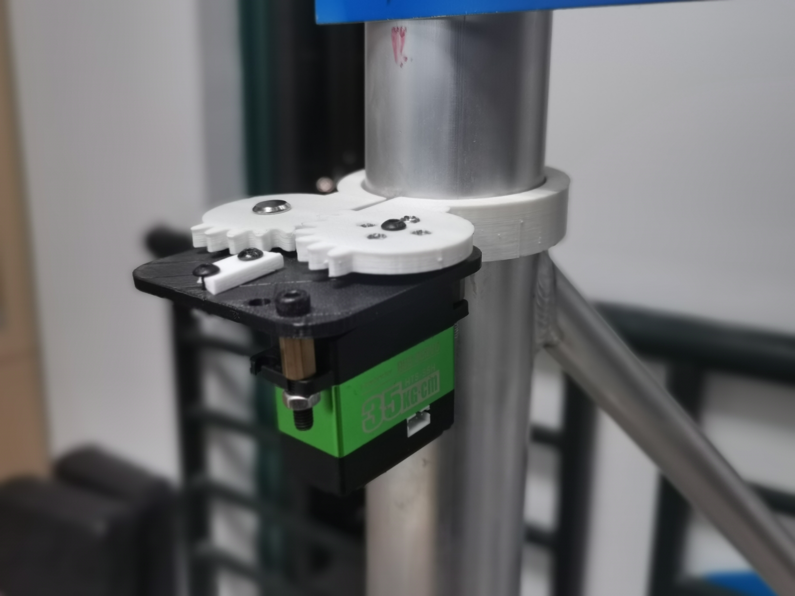

# 机械组独立考核任务安排

Author：@LinHuangnan

Revise：

| 版本 | 说明 |备注|
| ---- | ---- | ---- |
| v0.0.0 | 建立文档 |无|

## 说明
- 本次考核和之后的考核独立，没通过本次考核的同学还可以参与后续正式考核
- 通过本次考核的同学可以正式成为空队机械组成员
- 本次考核难度较高，考验团队协作能力，因此我们采取分组考核的形式
- 因为报名人数较多，我们将大家分为3个小组，每个小组3位同学，我们会给每个小组评出总分，之后对根据每位同学在小组任务里的贡献度，将总分按比例分配到每位组员身上

## SolidWorks安装

参考考核仓库指南Solidworks部分

## 任务安排
### 1、自学任务安排 (8.24-8.26)
- 自学SolidWorks，参考[B站的SolidWorks教程](https://www.bilibili.com/video/BV1iw411Z7HZ?spm_id_from=333.337.search-card.all.click&vd_source=28eca9a455dd3210d721b4694d3c4aa1)，只需要学到`P21附加课7 转配体阵列&镜像与外观`即可
- 刷完教程之后，可以跟着B站上的其他画一些有趣的东西，比如四旋翼的建模等等，来巩固刚刚学会的Solidworks基本操作技巧

### 2、子机器人搭建任务安排 (8.27-9.3)
#### 子机器人的各个组成部分
首先介绍一下子机器人的组成部分，子机器人主要由由`滑轨`,`通信模块抓手`,`桅杆抓手`,`连接件`等部分组成，可以参考下图：

这里介绍一下各个部分的作用

`滑轨` 滑轨的前进后退可以实现通信模块的取下与更换

`框架抓手` 桅杆抓手的作用是将子机器人限位在桅杆上

`通信模块抓手` 通信模块抓手的作用是完成通信模块的取下和替换

`连接件` 实现子机器人与无人机的分离

#### 任务要求
- 自己设计或者改进考核仓库提供中的`通信模块抓手`和`桅杆抓手`，使之能够完成上一小节中描述的功能
- 设计`滑轨`，使之能够完成上一小节中描述的功能
- 设计`连接件`，使之能够完成上一小节中描述的功能
- 将各个部分集成起来，形成整个子机器人
- 用实验室的铝方管，3D打印机等，验证可行性之后，在SolidWorks上绘制装配图，发往工厂加工

#### 子机器人的工作流程

**所设计的子机器人应该能够执行如下操作**

首先说明一下我们的任务，我们的任务是无人机携带2kg重的通信模块，穿越3km的航程，识别到目标桅杆，将桅杆上原有通信模块取下，替换为空中机器人携带的通信模块，随后返回任务出发点，整个过程需要在9分钟内完成。特别需要注意的是，目标桅杆将会不规则的前后左右摆动，其上有着强电磁，旋转摆臂等对无人机“致命”的干扰。

因此我们所设计的子机器人应该具备如下功能，无人机根据视觉提供的信息，先找到桅杆的正面，然后子机器人的`桅杆抓手`抓住桅杆，之后通过所设计的`连接件`，实现子机器人与无人机脱离，随后无人机便可以返航，子机器人先将桅杆上原有的通信模块取下，替换上子机器人携带的通信模块；

**注** 这里解释一下使用子机器人的原因，因为通信模块的重量过大（2kg），如果直接采取无人机携带机械臂进行通信模块的更换，将会给无人机的控制带来很大的麻烦，视觉也无法做到精准的定位，因此这里我们采用的办法就是无人机携带子机器人，无人机的任务就是将子机器人送至桅杆，子机器人一旦固定在桅杆上，就和无人机脱离，子机器人限位在桅杆上。

**注** 搭建子机器人过程中所有的器材由实验室提供，实验室没有的材料可以咨询@LinHuangnan之后购买，实验室可以提供报销

## 任务思路
我们给大家分别提供了`桅杆抓手`，`通信模块抓手`，`连接件`的初版，希望大家可以发挥自己的想象力和创造力，在我们提供的初版的基础上进行修改，或者有更好的想法也可以自行设计一个全新的模块，使之能够更好地完成抓取任务；

滑轨的制作是子机器人平台搭建的一大难点，我们将会在8.27号现场进行实物展示和思路讲解，具体的实现就靠大家的团队协作了，我们只会提供思路上的帮助；

搭建完`滑轨`，`桅杆抓手`，`通信模块抓手`，`连接件`之后，更重要的是实现各个模块的装配，将其整合到整个子机器人平台上；

这边建议大家先用实验室的铝方管等器材先搭建大致模型，形成一个整体的框架，然后在SolidWorks上进行完整的建模，形成整个装配图，子机器人框架的部分可以发完工厂进行加工，最后将抓手模块，连接件等集成上去；

希望大家在一周的时间内能够发挥团队协作精神，设计出一款能够工作的子机器人，因为STM32的入门需要比较长的时间，这里不要求大家对子机器人的控制代码进行编写，只需要设计出合理的机械结构即可。

**注** 搭建过程中所有的器材由实验室提供，实验室没有的材料可以咨询@林黄楠之后购买，实验室可以提供报销

**注** 遇到问题可以和实验室的师兄一起讨论，师兄们都是很乐意帮忙的，而且他们的经验也很丰富

## 成绩评判
| 打分项 | 分值 |
| ---- | ---- | 
| 通信模块抓手的设计 | 100分 |
| 桅杆抓手的设计 | 100分 |
| 连接件的设计 | 50分 |
| 滑轨的设计 | 150分 |
| 子机器人平台的搭建 | 300分 |
| 任务整体完成情况，包括创新性和可行性 | 300分 |

**注** 这里解释一下什么是创新型和可行性，举几个简单的小例子

比方说这个通信模块抓手

可以看到那两个爪子的开口是弧形的，开口很大，之后慢慢减小，其实是为了给视觉组降低难度，因为开口大，视觉的定位不用那么准确，就能够抓住通信模块的那两个细杆，以及通信模块抓手其实设计了一个倾斜的角度，其实是为了适应通信模块两个细杆的倾斜

再比方说，使用滑轨其实也是降低系统的复杂度，相当于只要子机器人限位在了桅杆上，系统就只剩下一个滑动的自由度了，这样大大降低了控制的难度

初版的抓手其实还是有不少的问题，首先因为通信模块比较重，抓手长时间抓着通信模块可能会导致舵机发热严重，可以基于此设计一些增大爪子摩擦力的方法来减少舵机的发热等等
